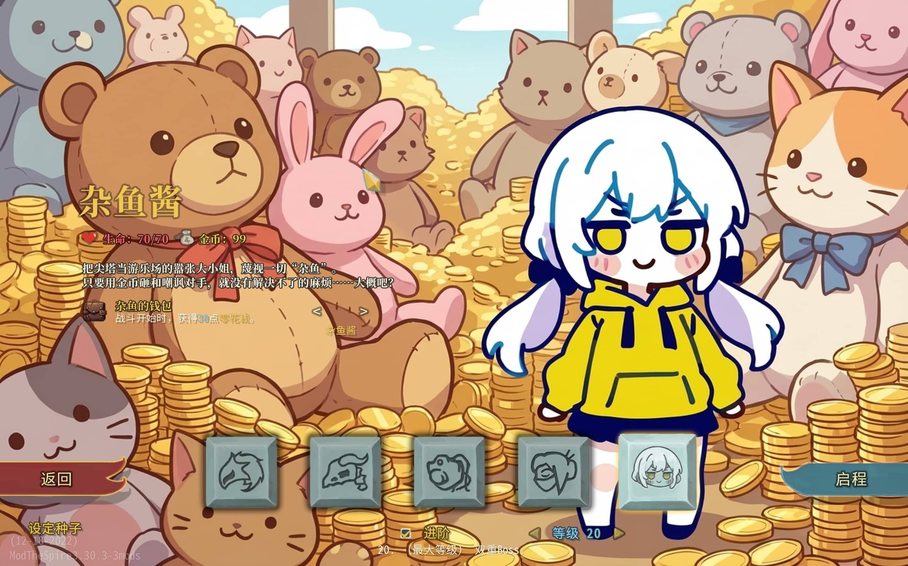
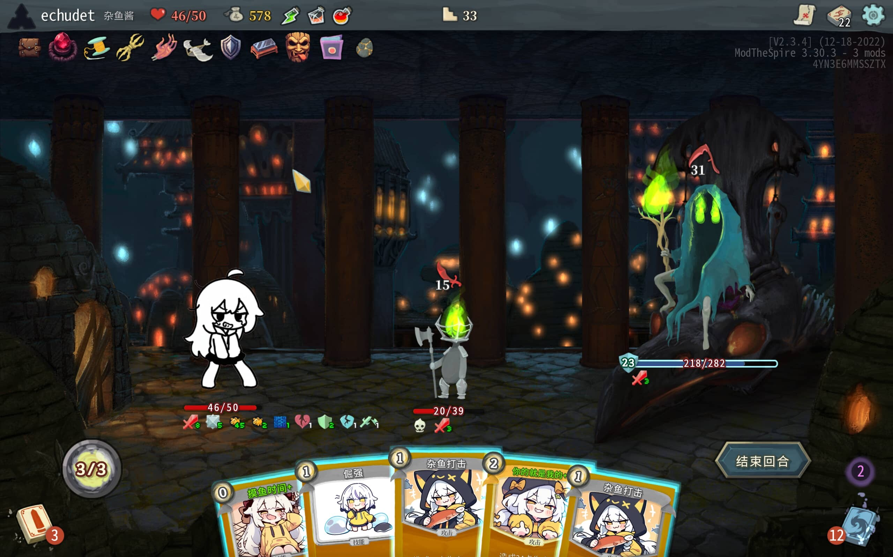
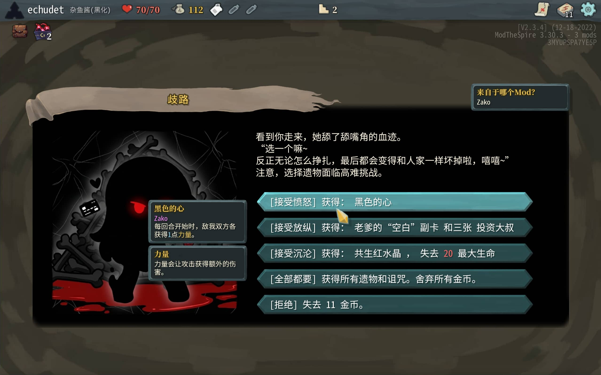

集齐了天地间有史以来所有雌小鬼刻板印象，在这里诞生的是--杂鱼酱！
欢呼吧，尖塔将迎来它的第一位雌小鬼大全者。雌小鬼文化将普照在尖塔每个角落。

接下来，有请--杂鱼酱！
“哈？那种眼神看着我干嘛？杂鱼~ 杂鱼~”
“既然你这么诚心诚意地求我了，那我就勉为其难地帮你爬塔吧！”
于是，杂鱼酱的大冒险开始了。

### MOD特色
1.都是杂鱼
不管是多强的BOSS，都要被拉到和杂鱼酱同一水平线！
属性同步： 独特的机制让你控制双方的力量与敏捷，利用平均大法和交换大法羞辱敌人。
众生平等： 敌人太强？用卡牌强行削弱它的数值，大家一起变杂鱼。
2.零花钱与氪金
怎么这么难？那是你充的太少了！
挥霍流： 消耗金币打出巨额伤害或高额防御。
利息流： 囤积零花钱抽牌，或者刷爆黑卡透支未来。
3.败犬反扑
打我呀？越打我越兴奋呀！
碰瓷机制： 故意卖血或挨打来触发强力效果。
受虐积怨： 身上负面状态越多，爆发伤害越高！

如果你破产了，或者把自己作死了……那是你太菜了，才不是杂鱼酱的错呢！略略略！

### 包含内容
80 张全新卡牌： 包含“嘲讽”、“氪金”两体系，还有一些过渡小流派卡牌。
24 件专属遗物： 和卡组流派紧密相关的遗物体系，其中一部分是只能通过事件取得的特殊遗物。
10 个专属事件： 勒索小贩、黑化抉择、逃避家教……在这个塔里随心所欲地捣乱吧！
2   个专属皮肤： 普通形态和黑化形态，黑化形态你将遇到？。

模组内的遗物和事件不会出现在其他角色中。

### 特别说明
模组内的图片基本由AI生成+微调。

设计：echudet
代码：echudet、claude、gemini
美术：echudet、noobAI-XL、nano banana

代码已开源于:https://github.com/EchudeT/StS-Mod-Zako
本mod已发布于steam创意工坊:https://steamcommunity.com/sharedfiles/filedetails/?id=3637320716
如有bug或其他问题，欢迎反馈与交流。

